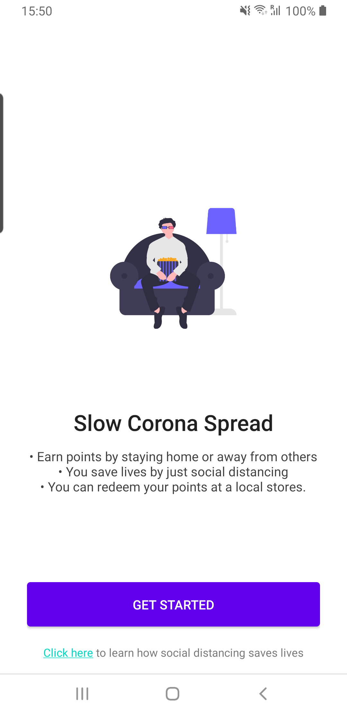
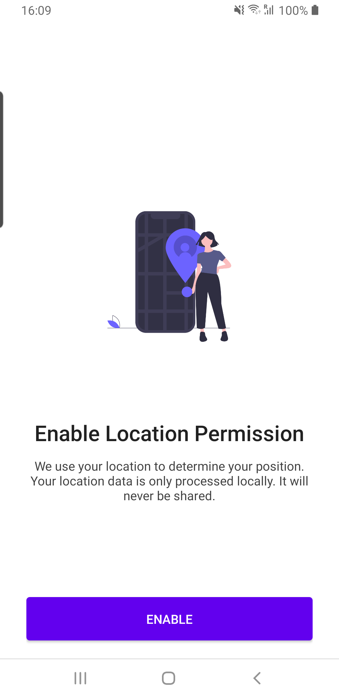
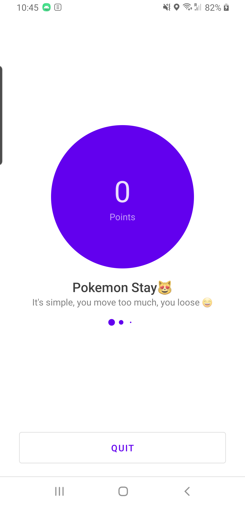
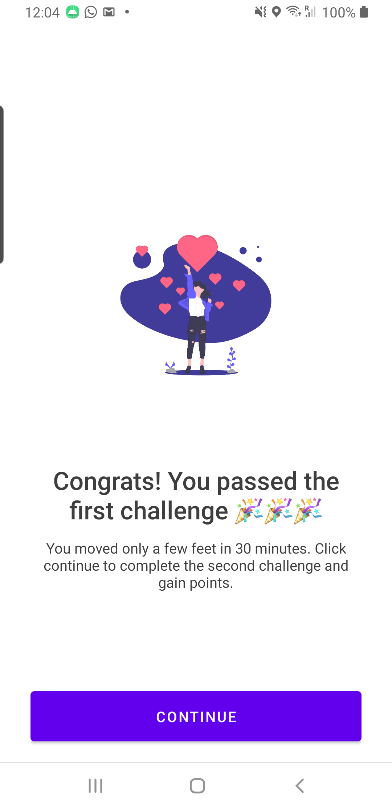
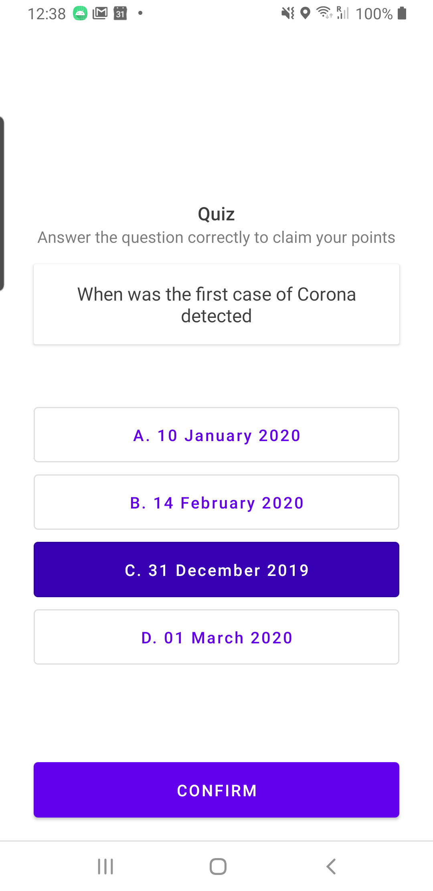
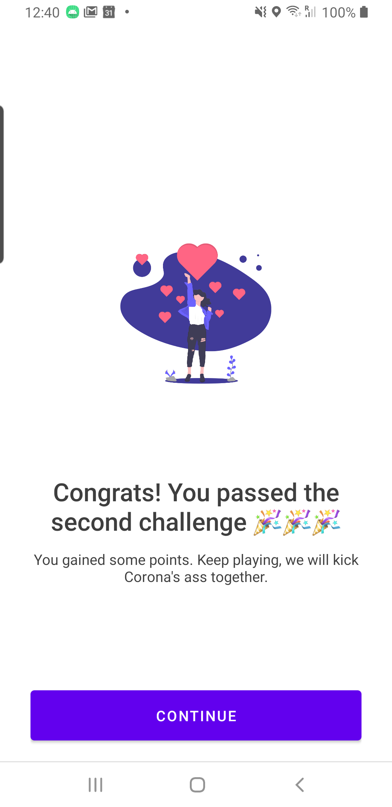
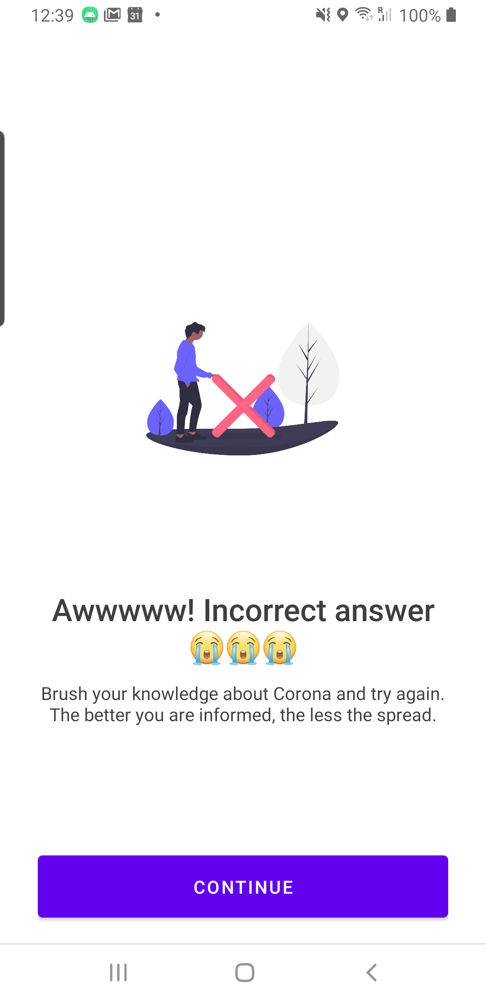

# Corona Go

Pokemon Go, but for social distancing.

Full privacy. Locations are processed locally.

PS: This project was just a hacky project I built based on this tweet: https://twitter.com/JoshConstine/status/1239243784392544256

## Screens
### Onboarding

### Enable location permission

### Home

### First challenge passed

### Quiz

### Second challenge passed

### Second challenge failed

Thanks to UnDraw for the free illustrations: https://undraw.co/illustrations

Thanks to FreeSound for the free sound: http://www.freesound.org/